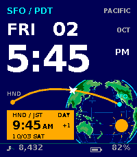
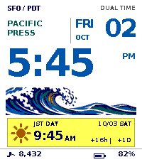

# PACIFIC RELAY — Time 2 watchfaces

Native `emery` (200×228) watchfaces connecting US Pacific time and Japan.
ORBIT ATLAS and PACIFIC PRESS use ImageGen artwork, emphasize Pacific time/date,
and keep JST secondary with a color change at 06:00/18:00 JST.

| Watchface | Download | Source | Preview |
|---|---|---|---|
| ORBIT ATLAS 1.0.0 | [PBW](dist/orbit-atlas.pbw) | [src/atlas](src/atlas) | [three design directions](designs/pacific-relay-designs.html) |
| PACIFIC PRESS 1.0.1 | [PBW](dist/pacific-press.pbw) | [src/press](src/press) | [white-background refinement](designs/pacific-press-refined.html) |
| PACIFIC RELAY | Build from the repository root | [src/c](src/c) | [original mockup](mockup.html) |
| PACIFIC RELAY SFO | `tools/prepare_reverse.py` | [shared base](src/c/main.c) | Pacific-primary version of the original |

| ORBIT ATLAS | PACIFIC PRESS |
|---|---|
|  |  |

The downloadable PBWs were installed and visually verified on a physical Time 2.
The shared C clock has 13 regression cases; native rendering has 10 Atlas and
17 Press emulator cases. The images above are synthetic emulator examples.
[Package verification](dist/verification.json) includes SHA256 hashes.

Both sessions' HTML studies and generation prompts are preserved in
[designs/](designs/README.md), including the additional
[wave / forest / radio concepts](designs/pacific-new-studies.html).
Open HTML files locally after cloning to use their interactive controls.

For CloudPebble installation and mobile foreground requirements, see
[dist/README.md](dist/README.md).

## Original PACIFIC RELAY

Retro flight-board watchface linking HND and SFO. In the published repository,
[`mockup.html`](mockup.html) is the 2x browser design specification beside this README; the
native Pebble implementation stays minimal in `src/c/`.

## Original features

- emery-only 200x228 watchface with one Window and one custom drawing Layer
- 12-hour JST (UTC+9) as the primary time and independent SFO local date/time
- automatic US Pacific PST/PDT calculation and day/night SFO color bands
- HealthService steps, BatteryStateService charge, and minute ticks
- low-contrast globe, curved HND>SFO route, DATE LINE, and status band
- no JavaScript, settings screen, image resources, or external dependencies

## Build and install

From the repository root with a Pebble SDK/Rebble toolchain:

```text
pebble build
pebble install --phone <phone-ip>
```

The project is intentionally targeted only at `emery` (Pebble Time 2).

## Reverse version (SFO primary / JST secondary)

The reverse package is **PACIFIC RELAY SFO**, with a separate UUID so both
watchfaces can be installed together. The large time and date follow Pacific
PST/PDT; the secondary HND / JST band uses Japan's date and day/night colors
(06:00–17:59 is day). The route reads SFO>HND. Steps still follow the watch's
HealthService daily total.

```text
python tools/prepare_reverse.py
cd work/reverse
pebble build
```

Install the generated `build/reverse.pbw` with the same Pebble
install command above. Building from the repository root still produces the
original JST-primary version.

## DST rule

`src/c/timezone.c` evaluates US rules in UTC: the second Sunday in March at
10:00 UTC starts PDT, and the first Sunday in November at 09:00 UTC ends it.
`tests/test_timezone.py` contains the UTC boundary assertions and source
contract check. Run it with `python tests/test_timezone.py` when a C compiler
is unavailable.

To exercise the actual C conversion on a Linux host with GCC:

```sh
mkdir -p work/host-test
printf '#include <stdbool.h>\n#include <time.h>\n' > work/host-test/pebble.h
gcc -std=c99 -Wall -Wextra -Werror -Iwork/host-test -Isrc/c tests/test_timezone.c src/c/timezone.c -o work/host-test/test_timezone
work/host-test/test_timezone
```

## ORBIT ATLAS (ImageGen globe / Pacific primary)

The approved ORBIT ATLAS design is a separate package with UUID
`bf0d7c6b-b3ec-4be0-ae3a-95c04d858e10`. The earlier packages can remain installed.
The original root build and reverse preparation script still produce their previous designs.

- Pacific PST/PDT time, weekday and day are dominant; the month is a small token.
- A 124×124 transparent, 13-color globe is generated with ImageGen and embedded
  as a 4-bit palette bitmap. The artwork is in `resources/atlas/images/`.
- A small JST card, route and sun/moon change at JST 06:00 and 18:00. `+1`
  means Japan's calendar date is one day ahead, including year rollover.
- Steps use the watch's HealthService daily total; battery and minute updates
  use the existing native services. There is no network request or JavaScript.
- Subset DejaVu Sans Bold fonts reproduce the HTML hierarchy at native size.
  The font license is included in `resources/atlas/fonts/LICENSE.txt` and embedded
  as an unneeded-at-runtime raw resource in the PBW.

Prepare and build:

```text
python tools/prepare_atlas.py
cd work/atlas
pebble build
```

The build produces `work/atlas/build/atlas.pbw`; the verified user deliverable
is copied to `dist/orbit-atlas.pbw`. The source is in `src/atlas/`, and the
existing `src/c/timezone.c` is shared during staging.

For emulator installation, run `pebble install --emulator emery build/atlas.pbw`
from `work/atlas`. A newly registered watchface may need to be selected in the
emulator's Watchfaces menu. `tools/capture_atlas.py` captures representative
states using the Pebble Tool Python environment after that selection. It uses
the SDK's screenshot service to record the native 64-color framebuffer values
without color correction. Its single persistent connection avoids the CLI's
per-command wall-time synchronization, and each fixture crosses a real minute
boundary before capture.

Host regression check, using the existing `work/host-test/pebble.h` shim:

```sh
gcc -std=c99 -Wall -Wextra -Werror -Iwork/host-test -Isrc/c -Isrc/atlas tests/test_atlas_clock.c src/atlas/clock.c src/c/timezone.c -o work/host-test/test_atlas_clock
work/host-test/test_atlas_clock
```

This exercises the actual atlas formatter and color-state logic at 13 fixed
UTC instants, including DST gaps/folds, Japanese day/night boundaries and
year rollover. The tested PBW uses real time and real native health/battery
services; example readings are injected only into the emulator.

The ten raw 200×228 captures can also be checked using Python with Pillow:
`python tests/verify_atlas_screenshots.py`. This checks Japanese card/rail colors,
the generated globe, separation of art from primary time and the battery bar.
The checker uses newly captured `outputs/` frames if present, otherwise the
committed synthetic frames in `tests/fixtures/atlas/`. The optional shell wrapper
uses `python3`; set `PEBBLE_PYTHON` to the Pebble Tool environment's interpreter
when its packages are installed in a separate virtual environment.

## PACIFIC PRESS (white background / Pacific primary)

PACIFIC PRESS is a separate Emery watchface with UUID
`aef4bb67-6838-43f8-9f52-59ff93b15fbc`. Its native source is in `src/press/`.
The staged project shares the tested `src/atlas/clock.c` formatter and
`src/c/timezone.c`; the previous packages retain their existing sources.

- White background, large Pacific time, and an upper-right weekday/day/month.
  Pacific time, AM/PM and date text use ocean navy `0x0055AA` in version 1.0.1.
- A cropped 184x39, 12-color indexed wave from the approved ImageGen artwork.
- JST 06:00–17:59 uses a yellow card and sun; night uses a blue card and moon.
- JST time/date, AM/PM, +16h/+17h and SAME/+1D are secondary information.
- Real HealthService steps, battery events, and minute/calendar ticks.

Prepare and build with the existing SDK:

```text
python tools/prepare_press.py
cd work/press
pebble build
```

The output is `work/press/build/press.pbw`; the verified delivery copy is
`dist/pacific-press.pbw`. DejaVu Sans Bold subsets and their license use the
existing `resources/atlas/fonts/` files. The PNG is in `resources/press/images/`.

For the existing CloudPebble developer connection:

```text
pebble login --status
pebble install --cloudpebble build/press.pbw
```

Enable Dev Connection in CloudPebble mode in the mobile app, using the account linked to the CLI.
After installation, choose PACIFIC PRESS if the watch keeps its previous face.
Local Wi-Fi installation via `pebble install --phone <phone-ip>` also works.

`tools/capture_press.py` uses the Pebble Tool Python environment to capture 17 fixed states
on the local Emery emulator only. Select PACIFIC PRESS in its Watchfaces menu
first. It rejects a non-white face or a stale JST card instead of accepting a
capture from a previously selected design. No fixture data is compiled into
the production PBW. Verify the raw captures with
`python tests/verify_press_screenshots.py` with Pillow. The checker falls back to
`tests/fixtures/press/` when no local `outputs/` frames are present.
The shared C regression check is
the same `tests/test_atlas_clock.c` check described above.

## License

MIT; see `LICENSE`.
